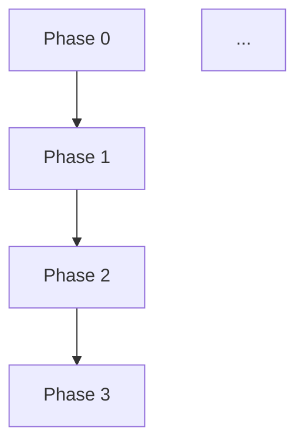

# Lesson Planning System Documentation

**Complete guide to the structured learning materials for Elixir Systems Mastery**

---

## 📚 Overview

This repository contains a comprehensive lesson planning system designed to transform the high-level curriculum roadmap into actionable, day-by-day learning materials for students pursuing Elixir systems mastery.

### System Components

The lesson planning system consists of **four interconnected layers**:

1. **Workbooks** - Interactive exercises and self-assessment
2. **Study Guides** - Reading schedules and daily objectives
3. **Lesson Plans** - Detailed teaching materials and facilitation guides
4. **Curriculum Map** - Visual dependencies and learning pathways

---

## 🗂️ Directory Structure

```
docs/
├── workbooks/                  # Interactive exercise workbooks
│   ├── phase-01-workbook.md
│   ├── phase-02-workbook.md   # (template available)
│   └── ...
├── guides/                     # Study guides with schedules
│   ├── phase-01-study-guide.md
│   ├── phase-02-study-guide.md  # (template available)
│   └── ...
├── lessons/                    # Detailed lesson plans
│   ├── phase-01-lesson-plan.md
│   ├── phase-02-lesson-plan.md  # (template available)
│   └── ...
├── curriculum-map.md           # Visual dependency graph
├── roadmap.md                  # Master curriculum (source of truth)
├── reading/                    # Book summaries & theory
│   ├── phase-01-core.md
│   └── ...
└── LESSON-PLANNING-SYSTEM.md   # This file
```

---

## 📖 Material Types

### 1. Workbooks (`docs/workbooks/`)

**Purpose:** Hands-on practice with immediate feedback

**Structure:**
- Learning checkpoints (7-10 per phase)
- Fill-in-the-blank code exercises
- Self-assessment questions
- Property-based testing challenges
- Final challenge project
- Solutions section (hidden by default)

**Usage:**
- Students work through sequentially
- Complete checkpoints before advancing
- Use alongside study guide
- Self-paced with built-in validation

**Example:** `docs/workbooks/phase-01-workbook.md`

**Key Features:**
```markdown
## 🎯 Learning Checkpoint 1: Pattern Matching & Guards

### Exercise 1.1: Complete the Pattern Match
[Interactive code exercise]

### ✅ Checkpoint 1 Self-Assessment
- [ ] I can match on tuples, lists, and maps
- [ ] I understand when to use guards
```

---

### 2. Study Guides (`docs/guides/`)

**Purpose:** Structured reading schedule with daily objectives

**Structure:**
- Phase overview and metadata
- Required reading list (books, docs, supplements)
- Day-by-day schedule (10-day breakdown)
- Morning/afternoon session structure
- Checkpoints and homework
- Completion checklist
- Self-assessment quiz

**Usage:**
- Students follow daily schedule
- Complete readings in recommended order
- Check off deliverables each day
- Track progress toward phase completion

**Example:** `docs/guides/phase-01-study-guide.md`

**Key Features:**
```markdown
### Day 1: Functional Programming Foundations (6-8 hours)

#### Morning Session (3-4 hours): Core Concepts
**Reading:**
- [ ] Programming Elixir Chapter 1
- [ ] Learn FP with Elixir Chapter 1

**Checkpoint:**
- [ ] Can explain immutability
- [ ] Can write 5 pattern match examples
```

---

### 3. Lesson Plans (`docs/lessons/`)

**Purpose:** Detailed teaching materials and facilitation guides

**Structure:**
- Learning objectives mapped to activities
- Weekly schedule (Week 1: theory, Week 2: implementation)
- Daily lesson structure (morning/afternoon)
- Teaching methodology notes
- Project specifications (labs + pulse apps)
- Drill requirements
- Assessment rubric
- Common pitfalls & solutions
- Instructor notes
- Debugging help

**Usage:**
- Instructors use to plan teaching
- Self-learners use as comprehensive reference
- Maps high-level roadmap to detailed activities
- Generated from roadmap + reading notes

**Example:** `docs/lessons/phase-01-lesson-plan.md`

**Key Features:**
```markdown
## 🎓 Teaching Methodology

### Active Learning Strategies
1. Read-Practice-Apply Cycle
2. Spaced Repetition
3. Progressive Complexity

## 📊 Assessment Rubric
- Code Quality (30%)
- Testing (25%)
- Documentation (15%)
```

---

### 4. Curriculum Map (`docs/curriculum-map.md`)

**Purpose:** Visual overview of learning pathways and dependencies

**Structure:**
- Mermaid dependency graphs
- Learning track descriptions
- Skill progression matrix
- Alternative pathways (Fast Track, Web-First, etc.)
- Quarterly roadmap view
- Competency level definitions
- Critical path analysis
- Progress tracking checklist

**Usage:**
- Choose appropriate learning path
- Understand phase prerequisites
- See the big picture
- Plan study schedule
- Track overall progress

**Example:** `docs/curriculum-map.md`

**Key Features:**


---

## 🔄 How the System Works Together

### For Self-Learners

```
1. START: Read curriculum-map.md
   → Choose learning path
   → Understand dependencies

2. FOR EACH PHASE:
   a. Read study guide (docs/guides/phase-N-study-guide.md)
      → See 10-day schedule
      → Know what to read each day

   b. Read books/docs according to schedule
      → Follow daily reading plan
      → Take notes in docs/reading/

   c. Work through workbook (docs/workbooks/phase-N-workbook.md)
      → Complete exercises
      → Check yourself at checkpoints

   d. Build apps (from lesson plan or roadmap)
      → Create labs_* app
      → Create pulse_* feature

   e. Verify completion
      → Run `make ci`
      → Check success criteria
      → Review self-assessment

3. ADVANCE to next phase
```

### For Instructors

```
1. PREP: Read lesson plan (docs/lessons/phase-N-lesson-plan.md)
   → Understand learning objectives
   → Review teaching methodology
   → Prepare materials

2. WEEK 1 (Theory):
   → Guide students through readings
   → Facilitate discussions
   → Assign workbook checkpoints
   → Monitor understanding

3. WEEK 2 (Practice):
   → Guide project implementation
   → Code reviews
   → Answer questions
   → Assess with rubric

4. WRAP-UP:
   → Verify mastery gate
   → Review performance targets
   → Advancement decision
```

### For Curriculum Designers

```
1. DESIGN new phase:
   → Add to roadmap.md
   → Create reading notes (docs/reading/)
   → Define learning objectives
   → Specify deliverables

2. GENERATE materials:
   → Create workbook from drills
   → Generate study guide from reading list
   → Build lesson plan from roadmap section
   → Update curriculum-map.md with dependencies

3. VALIDATE:
   → Pilot with students
   → Gather feedback
   → Iterate on materials
   → Update templates
```

---

## 📝 Templates

### Workbook Template

```markdown
# Phase N Workbook — [Topic Name]

**Interactive exercises for [key skill]**

## 📋 Workbook Overview
- Purpose
- Prerequisites
- Time Estimate
- How to Use

## 🎯 Learning Checkpoint 1: [Concept]

### Exercise 1.1: [Skill]
[Code exercise]

### ✅ Checkpoint 1 Self-Assessment
- [ ] Learning objective 1
- [ ] Learning objective 2

[Repeat for 7-10 checkpoints]

## 🎯 Final Challenge
[Comprehensive project]

## ✅ Final Self-Assessment
[Verify readiness to advance]

## 📚 Solutions
<details>
[Hidden solutions]
</details>
```

### Study Guide Template

```markdown
# Phase N Study Guide — [Topic Name]

**Structured learning path with reading schedule**

## 📚 Study Guide Overview
- Duration
- Prerequisites
- Deliverables

## 📖 Required Reading
- Books (with chapter ranges)
- Docs (with links)
- Supplements

## 🗓️ Day-by-Day Schedule

### Day 1: [Topic]
#### Morning Session (3-4 hours)
- Reading checklist
- Key concepts
- Practice exercises
- Checkpoint

#### Afternoon Session (3-4 hours)
- Deep dive
- Hands-on
- Homework

[Repeat for 10 days]

## ✅ Phase Completion Checklist
[All success criteria]

## 📊 Self-Assessment Quiz
[Conceptual + practical]
```

### Lesson Plan Template

```markdown
# Phase N Lesson Plan — [Topic Name]

**Auto-generated from roadmap and reading materials**

## 📋 Lesson Plan Metadata
- Duration
- Prerequisites
- Mastery Definition

## 🎯 Learning Objectives
[5-6 specific, measurable objectives]

## 📚 Required Materials
[Books, docs, supplements]

## 🗓️ Weekly Schedule
### Week 1: Theory
[Day-by-day breakdown]

### Week 2: Practice
[Project implementation]

## 🎓 Teaching Methodology
[Active learning strategies]

## 🏗️ Projects & Deliverables
[Labs + Pulse apps with structure]

## 📊 Assessment Rubric
[Grading criteria]

## 🚨 Common Pitfalls
[Issues and solutions]

## 🎓 Instructor Notes
[Facilitation tips]
```

---

## 🎯 Best Practices

### For Creating Workbooks

1. **Start with learning objectives** from roadmap
2. **Create 7-10 checkpoints** covering each objective
3. **Progress from simple to complex** exercises
4. **Include self-assessment** after each checkpoint
5. **Provide solutions** but hide by default
6. **Add a final challenge** that combines all skills
7. **Link to related materials** (study guide, lesson plan)

### For Creating Study Guides

1. **Break into 10-day schedule** (or adjust for phase duration)
2. **Assign specific readings** to each day with page numbers
3. **Balance theory and practice** (Week 1 reading, Week 2 coding)
4. **Include checkpoints** at end of each day
5. **Specify deliverables** clearly
6. **Add self-assessment quiz** at end
7. **Reference workbook exercises** in homework

### For Creating Lesson Plans

1. **Start from roadmap.md** as source of truth
2. **Extract learning objectives** verbatim
3. **Map readings to daily schedule**
4. **Include teaching methodology** notes
5. **Provide assessment rubrics** for grading
6. **Document common pitfalls** from experience
7. **Add instructor facilitation tips**
8. **Auto-generate when possible** to stay in sync

### For Maintaining Curriculum Map

1. **Update dependencies** when phases change
2. **Keep time estimates accurate** based on feedback
3. **Show multiple pathways** for different goals
4. **Visualize with Mermaid** for clarity
5. **Include skill progression** matrix
6. **Track completion** with checkboxes
7. **Highlight critical path** for planning

---

## 🔧 Maintenance & Updates

### When to Update Materials

**Update workbook when:**
- New drills added to roadmap
- Students struggle with specific concepts
- Better exercise examples discovered
- New Elixir features available

**Update study guide when:**
- Reading materials change (new book editions)
- Time estimates prove inaccurate
- Better daily pacing discovered
- Prerequisites change

**Update lesson plan when:**
- Roadmap changes (source of truth)
- Reading notes updated
- Teaching methodology improves
- Assessment rubrics refined

**Update curriculum map when:**
- New phases added
- Dependencies change
- Alternative pathways discovered
- Skill progressions shift

### Version Control

**All materials should be versioned:**

```markdown
**Generated:** 2025-11-05
**Version:** 1.0
**Maintainer:** [Name]
**Based on:** docs/roadmap.md v1.2
```

**Update versions when:**
- Major changes (increment to 2.0)
- Minor improvements (increment to 1.1)
- Typo fixes (increment to 1.0.1)

### Feedback Loop

```
Students complete phase
    ↓
Collect feedback (survey + retrospective)
    ↓
Identify pain points
    ↓
Update materials
    ↓
Increment version
    ↓
Pilot with next cohort
    ↓
Repeat
```

---

## 📊 Quality Checklist

Use this checklist when creating or updating materials:

### Workbook Quality

- [ ] Learning objectives clearly stated
- [ ] 7-10 checkpoints covering all objectives
- [ ] Progressive difficulty (simple → complex)
- [ ] Self-assessment after each checkpoint
- [ ] Solutions provided (but hidden)
- [ ] Final challenge included
- [ ] Links to study guide and lesson plan
- [ ] Estimated time provided
- [ ] Prerequisites listed

### Study Guide Quality

- [ ] 10-day schedule (or phase-appropriate)
- [ ] Specific readings assigned per day
- [ ] Morning/afternoon structure
- [ ] Checkpoints at end of each day
- [ ] Homework clearly specified
- [ ] Completion checklist comprehensive
- [ ] Self-assessment quiz included
- [ ] Time estimates realistic
- [ ] Links to workbook exercises

### Lesson Plan Quality

- [ ] Generated from roadmap (in sync)
- [ ] Learning objectives match roadmap
- [ ] Weekly schedule detailed
- [ ] Teaching methodology documented
- [ ] Assessment rubric included
- [ ] Common pitfalls listed
- [ ] Instructor notes helpful
- [ ] Project specs complete
- [ ] Version and date stamped

### Curriculum Map Quality

- [ ] All phases represented
- [ ] Dependencies accurate
- [ ] Mermaid graphs render correctly
- [ ] Alternative pathways shown
- [ ] Time estimates match roadmap
- [ ] Skill progression visualized
- [ ] Progress tracking available
- [ ] Critical path identified

---

## 🎓 Usage Examples

### Example 1: Self-Learner Starting Phase 1

**Day 0 (Planning):**
1. Read `docs/curriculum-map.md` → Understand Phase 1 prerequisites
2. Read `docs/guides/phase-01-study-guide.md` → See 10-day plan
3. Gather books: Programming Elixir, Learn FP with Elixir
4. Set up workspace, open `docs/workbooks/phase-01-workbook.md`

**Day 1 (Learning):**
1. Follow study guide Day 1 morning schedule
2. Read Programming Elixir Ch 1-2 (pattern matching)
3. Practice in IEx as directed
4. Complete Workbook Checkpoint 1 (pattern matching exercises)
5. Check self-assessment boxes
6. Update progress in study guide

**Day 7 (Building):**
1. Study guide says "Build labs_csv_stats"
2. Reference lesson plan for project structure
3. Implement CSV parser module
4. Run tests, check coverage
5. Complete workbook CSV parsing checkpoint

**Day 10 (Completion):**
1. Verify all study guide checkboxes complete
2. Run `make ci` (mastery gate)
3. Review self-assessment quiz
4. Update `docs/curriculum-map.md` progress
5. Advance to Phase 2

### Example 2: Instructor Teaching Phase 1

**Week Before (Prep):**
1. Read `docs/lessons/phase-01-lesson-plan.md` fully
2. Review teaching methodology section
3. Prepare code examples from lesson plan
4. Review assessment rubric
5. Set up grading spreadsheet

**Week 1 Day 1 (Teaching):**
1. Follow lesson plan daily structure
2. Assign readings from study guide
3. Guide students through workbook Checkpoint 1
4. Facilitate discussion on pattern matching
5. Answer questions using "Instructor Notes"

**Week 2 Day 7 (Code Review):**
1. Students submit labs_csv_stats for review
2. Use assessment rubric from lesson plan
3. Check common pitfalls from lesson plan
4. Provide feedback on code quality
5. Assign fixes for next day

**Week 2 Day 10 (Assessment):**
1. Verify all success criteria met
2. Run `make ci` with each student
3. Review self-assessment quizzes
4. Make advancement decisions
5. Collect feedback for material updates

### Example 3: Curriculum Designer Adding Phase 16

**Step 1: Update Roadmap**
```markdown
### Phase 16 — WebAssembly Integration
[Add to docs/roadmap.md]
```

**Step 2: Create Reading Notes**
```bash
# Create docs/reading/phase-16-wasm.md
# Summarize books and docs
```

**Step 3: Generate Workbook**
```bash
# Create docs/workbooks/phase-16-workbook.md
# Use template, add exercises for WASM skills
```

**Step 4: Generate Study Guide**
```bash
# Create docs/guides/phase-16-study-guide.md
# Map readings to 10-day schedule
```

**Step 5: Generate Lesson Plan**
```bash
# Create docs/lessons/phase-16-lesson-plan.md
# Auto-generate from roadmap + reading notes
```

**Step 6: Update Curriculum Map**
```markdown
# Update docs/curriculum-map.md
# Add Phase 16 node to Mermaid graph
# Update dependencies (Phase 15 → Phase 16)
# Update time estimates
```

**Step 7: Pilot & Iterate**
1. Test with first cohort
2. Gather feedback
3. Update materials
4. Increment versions

---

## 🚀 Quick Start Guide

### I'm a Student - Where Do I Start?

1. **Read this file** to understand the system ✓
2. **Open `docs/curriculum-map.md`** to see the big picture
3. **Read `docs/guides/phase-01-study-guide.md`** for your schedule
4. **Open `docs/workbooks/phase-01-workbook.md`** for exercises
5. **Start Day 1** following the study guide
6. **Check off progress** as you complete each day

### I'm an Instructor - How Do I Use This?

1. **Read this file** to understand the system ✓
2. **Open `docs/lessons/phase-N-lesson-plan.md`** for your teaching phase
3. **Review teaching methodology** and assessment rubric
4. **Assign readings** from study guide to students
5. **Guide students** through workbook exercises
6. **Grade projects** using assessment rubric
7. **Collect feedback** and suggest material updates

### I'm a Curriculum Designer - How Do I Add Content?

1. **Read this file** to understand the system ✓
2. **Update `docs/roadmap.md`** first (source of truth)
3. **Create reading notes** in `docs/reading/`
4. **Use templates** to create workbook, study guide, lesson plan
5. **Update `docs/curriculum-map.md`** with new dependencies
6. **Version all materials** with dates and version numbers
7. **Pilot with students** and iterate

---

## 📚 Related Documentation

- **Master Curriculum:** `docs/roadmap.md` (source of truth)
- **Reading Notes:** `docs/reading/phase-*.md` (theory summaries)
- **Project README:** `README.md` (project overview)
- **Contributing Guide:** `CONTRIBUTING.md` (how to contribute)

---

## 🆘 Support & Questions

**Questions about the system?**
- Read this file fully
- Check templates section
- Review examples section

**Questions about specific phase?**
- Read that phase's lesson plan
- Review study guide for that phase
- Check workbook exercises

**Questions about learning path?**
- Read curriculum map
- Choose alternative pathway if needed
- Assess current skill level

**Want to suggest improvements?**
- Open issue on GitHub
- Submit PR with updates
- Share feedback after completing phase

---

## 📈 Metrics & Success

### How to Measure Success

**Student Success:**
- Completion rate of each phase
- Time to complete vs estimate
- Quality of submitted code
- Self-assessment scores

**Material Quality:**
- Student feedback scores
- Completion rate of exercises
- Time estimates accuracy
- Instructor satisfaction

**System Success:**
- Materials stay in sync with roadmap
- New phases can be added quickly
- Templates are reusable
- Continuous improvement happening

---

## 🎉 Conclusion

This lesson planning system transforms a high-level roadmap into actionable daily learning materials. The four-layer approach (workbooks, study guides, lesson plans, curriculum map) provides:

✓ **Structure** for self-learners
✓ **Guidance** for instructors
✓ **Flexibility** for different learning paths
✓ **Scalability** for adding new phases
✓ **Consistency** across all phases
✓ **Traceability** back to roadmap

By following this system, students can progress from beginner to expert systematically, with clear milestones and comprehensive support materials at every step.

---

**Document Version:** 1.0
**Created:** 2025-11-05
**Maintainer:** System
**Related Files:**
- `docs/curriculum-map.md`
- `docs/workbooks/phase-01-workbook.md`
- `docs/guides/phase-01-study-guide.md`
- `docs/lessons/phase-01-lesson-plan.md`
