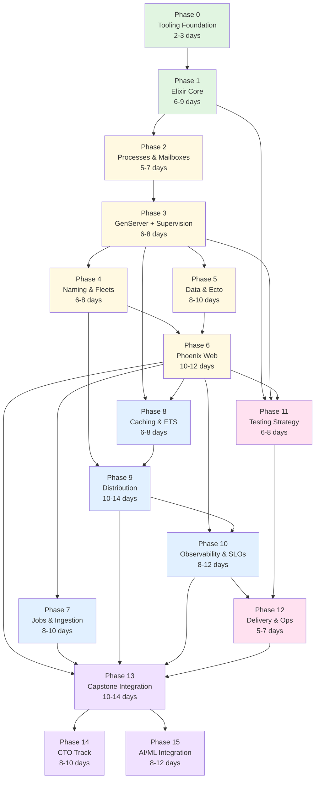

# Elixir Systems Mastery — Visual Curriculum Map

**Interactive dependency graph and learning pathway visualization**

---

## 📊 Phase Dependency Graph



**Legend:**
- 🟢 Green = Foundation (Phases 0-1)
- 🟡 Yellow = Core Concurrency (Phases 2-6)
- 🔵 Blue = Advanced Systems (Phases 7-10)
- 🔴 Pink = Operations (Phases 11-12)
- 🟣 Purple = Integration & Specialization (Phases 13-15)

---

## 🎯 Learning Tracks

### Track 1: Language Fundamentals (Phases 0-1)
**Duration:** 8-12 days | **Difficulty:** ⭐⭐

```
Phase 0 → Phase 1
[Tooling] → [FP Core]
```

**Skills Gained:**
- ✓ Functional programming mindset
- ✓ Pattern matching & recursion
- ✓ Enum/Stream pipelines
- ✓ Quality gates & CI/CD

**Prerequisites:** None

**Can Branch To:** Phase 2 (Processes) or Phase 11 (Testing)

---

### Track 2: Concurrency Basics (Phases 2-4)
**Duration:** 17-23 days | **Difficulty:** ⭐⭐⭐

```
Phase 1 → Phase 2 → Phase 3 → Phase 4
[FP Core] → [Processes] → [GenServer] → [Fleets]
```

**Skills Gained:**
- ✓ Process creation & message passing
- ✓ GenServer patterns
- ✓ Supervision trees
- ✓ Registry & dynamic supervision
- ✓ Worker fleets

**Prerequisites:** Phase 1 complete

**Can Branch To:** Phase 5 (Data), Phase 6 (Web), Phase 8 (Caching), Phase 9 (Distribution)

---

### Track 3: Data & Web (Phases 5-6)
**Duration:** 18-22 days | **Difficulty:** ⭐⭐⭐⭐

```
Phase 3 → Phase 5 → Phase 6
[GenServer] → [Ecto] → [Phoenix]
         ↘         ↗
          Phase 4
         [Fleets]
```

**Skills Gained:**
- ✓ Database design & migrations
- ✓ Ecto changesets & queries
- ✓ Phoenix MVC
- ✓ LiveView real-time UIs
- ✓ Channels & Presence

**Prerequisites:** Phases 3, 4, 5 complete

**Can Branch To:** Phase 7 (Jobs), Phase 8 (Caching), Phase 10 (Observability), Phase 13 (Capstone)

---

### Track 4: Data Flow & Caching (Phases 7-8)
**Duration:** 14-18 days | **Difficulty:** ⭐⭐⭐⭐

```
Phase 6 → Phase 7        Phase 3 → Phase 8
[Phoenix] → [Broadway/Oban]    [GenServer] → [ETS Cache]
                                     ↓
                                 Phase 6
                                [Phoenix]
                                     ↓
                                 Phase 8
                                [ETS Cache]
```

**Skills Gained:**
- ✓ Broadway pipelines
- ✓ Oban background jobs
- ✓ Backpressure handling
- ✓ ETS read-through cache
- ✓ Cache invalidation

**Prerequisites:** Phase 6 for Phase 7; Phases 3, 6 for Phase 8

**Can Branch To:** Phase 9 (Distribution), Phase 13 (Capstone)

---

### Track 5: Distribution (Phase 9)
**Duration:** 10-14 days | **Difficulty:** ⭐⭐⭐⭐⭐

```
Phase 4 → Phase 9
[Fleets] → [Distribution]
    ↓
Phase 8 →
[Cache] →
```

**Skills Gained:**
- ✓ libcluster setup
- ✓ Distributed Erlang
- ✓ Consistent hashing
- ✓ Node discovery
- ✓ Split-brain handling

**Prerequisites:** Phases 4, 8 complete

**Can Branch To:** Phase 10 (Observability), Phase 13 (Capstone)

---

### Track 6: Observability (Phase 10)
**Duration:** 8-12 days | **Difficulty:** ⭐⭐⭐⭐

```
Phase 6 → Phase 10
[Phoenix] → [Observability]
    ↓
Phase 9 →
[Distribution] →
```

**Skills Gained:**
- ✓ OpenTelemetry instrumentation
- ✓ Prometheus metrics
- ✓ Grafana dashboards
- ✓ SLO definitions
- ✓ Distributed tracing

**Prerequisites:** Phases 6, 9 complete

**Can Branch To:** Phase 12 (Delivery), Phase 13 (Capstone)

---

### Track 7: Operations (Phases 11-12)
**Duration:** 11-15 days | **Difficulty:** ⭐⭐⭐

```
Phase 1, 3, 6 → Phase 11 → Phase 12
[Multiple]     [Testing]   [Delivery]
                              ↑
                         Phase 10
                      [Observability]
```

**Skills Gained:**
- ✓ Test strategy & organization
- ✓ Integration testing
- ✓ Contract testing
- ✓ Mix releases
- ✓ Health checks
- ✓ Graceful shutdown

**Prerequisites:** Phase 10 for Phase 12

**Can Branch To:** Phase 13 (Capstone)

---

### Track 8: Capstone & Specialization (Phases 13-15)
**Duration:** 26-36 days | **Difficulty:** ⭐⭐⭐⭐⭐

```
Phases 6, 7, 9, 10, 12 → Phase 13 → Phase 14 → Phase 15
[All Major Phases]      [Capstone]  [CTO Track] [AI/ML]
```

**Skills Gained:**
- ✓ Full system integration
- ✓ Chaos engineering
- ✓ Security & compliance
- ✓ Incident response
- ✓ ML model serving
- ✓ AI integration

**Prerequisites:** Most phases complete for Phase 13

---

## 📈 Skill Progression Matrix

| Skill Area | Phase 1 | Phase 3 | Phase 6 | Phase 9 | Phase 13 |
|------------|---------|---------|---------|---------|----------|
| **FP Concepts** | ████████ 80% | ████████ 80% | ████████ 80% | ████████ 80% | ████████ 80% |
| **Concurrency** | ██░░░░░░ 20% | ███████░ 70% | ████████ 80% | ████████ 80% | ████████ 80% |
| **OTP** | █░░░░░░░ 10% | ████████ 80% | ████████ 80% | ████████ 80% | ████████ 80% |
| **Data/Ecto** | ░░░░░░░░ 0% | ░░░░░░░░ 0% | ████████ 80% | ████████ 80% | ████████ 80% |
| **Web/Phoenix** | ░░░░░░░░ 0% | ░░░░░░░░ 0% | ████████ 80% | ████████ 80% | ████████ 80% |
| **Distribution** | ░░░░░░░░ 0% | ░░░░░░░░ 0% | █░░░░░░░ 10% | ████████ 80% | ████████ 80% |
| **Observability** | ░░░░░░░░ 0% | █░░░░░░░ 10% | ███░░░░░ 30% | █████░░░ 50% | ████████ 80% |
| **Operations** | ██░░░░░░ 20% | ███░░░░░ 30% | █████░░░ 50% | ██████░░ 60% | ████████ 80% |
| **Testing** | ████░░░░ 40% | █████░░░ 50% | ██████░░ 60% | ███████░ 70% | ████████ 80% |
| **Architecture** | ░░░░░░░░ 0% | ██░░░░░░ 20% | █████░░░ 50% | ███████░ 70% | ████████ 80% |

---

## 🗺️ Alternative Learning Paths

### Fast Track (Experienced Developers)
**Duration:** 60-80 days

```
P0 → P1 → P3 → P5 → P6 → P9 → P10 → P13
```

*Skip Phase 2, 4 if you have concurrency experience*
*Skip Phase 7, 8 if focusing on monolith first*

### Web-First Path
**Duration:** 50-70 days

```
P0 → P1 → P2 → P3 → P5 → P6 → P10 → P11 → P12
```

*Focus on getting a Phoenix app production-ready quickly*

### Systems Engineering Path
**Duration:** 90-120 days

```
P0 → P1 → P2 → P3 → P4 → P8 → P9 → P10 → P11 → P12 → P13
```

*Deep dive into distributed systems, skip web*

### Full Curriculum (Comprehensive)
**Duration:** 120-180 days

```
P0 → P1 → P2 → P3 → P4 → P5 → P6 → P7 → P8 → P9 → P10 → P11 → P12 → P13 → P14 → P15
```

*Complete all phases in sequence*

---

## 📅 Quarterly Roadmap View

### Q1: Foundation & Core (Phases 0-4)
**Weeks 1-8**

```
Week 1-2:   Phase 0-1 (Tooling, FP Core)
Week 3-4:   Phase 2 (Processes & Mailboxes)
Week 5-6:   Phase 3 (GenServer + Supervision)
Week 7-8:   Phase 4 (Naming & Fleets)
```

**Milestone:** Can build concurrent systems with supervision

### Q2: Data & Web (Phases 5-7)
**Weeks 9-18**

```
Week 9-11:  Phase 5 (Data & Ecto)
Week 12-16: Phase 6 (Phoenix Web)
Week 17-18: Phase 7 (Jobs & Ingestion)
```

**Milestone:** Can build full-stack Phoenix app with background jobs

### Q3: Advanced Systems (Phases 8-10)
**Weeks 19-28**

```
Week 19-21: Phase 8 (Caching & ETS)
Week 22-25: Phase 9 (Distribution)
Week 26-28: Phase 10 (Observability & SLOs)
```

**Milestone:** Can build distributed, observable systems

### Q4: Operations & Specialization (Phases 11-15)
**Weeks 29-42**

```
Week 29-31: Phase 11 (Testing Strategy)
Week 32-33: Phase 12 (Delivery & Ops)
Week 34-37: Phase 13 (Capstone Integration)
Week 38-40: Phase 14 (CTO Track)
Week 41-42: Phase 15 (AI/ML Integration)
```

**Milestone:** Production-ready systems architect

---

## 🎓 Competency Levels

### Level 1: Beginner (Phases 0-1)
**After 8-12 days**

Can write:
- Pure functions
- Pattern matching
- Basic recursion
- Unit tests

Cannot yet:
- Build concurrent systems
- Handle state
- Build web apps

### Level 2: Intermediate (Phases 0-4)
**After 35-50 days**

Can write:
- Concurrent processes
- GenServer modules
- Supervised systems
- Worker fleets

Cannot yet:
- Build web apps
- Design databases
- Distribute systems

### Level 3: Advanced (Phases 0-6)
**After 53-72 days**

Can write:
- Phoenix web apps
- LiveView UIs
- Database schemas
- Real-time features

Cannot yet:
- Distribute systems
- Set up observability
- Deploy to production

### Level 4: Expert (Phases 0-10)
**After 87-125 days**

Can write:
- Distributed systems
- Observable services
- Cached data layers
- Background pipelines

Cannot yet:
- Handle complex testing strategies
- Manage production deployments
- Design system architecture

### Level 5: Master (All Phases)
**After 120-180 days**

Can write:
- Production-grade systems
- Secure, compliant services
- ML-powered features
- Incident response automation

Ready for:
- Lead engineer roles
- Systems architect positions
- Production operations

---

## 🔄 Skill Dependencies

```
┌─────────────────────────────────────────────────────────────┐
│                    Elixir Skill Tree                        │
└─────────────────────────────────────────────────────────────┘

                    [Pattern Matching]
                           │
                           ↓
                    [Pure Functions]
                           │
                ┌──────────┴──────────┐
                ↓                     ↓
          [Recursion]            [Pipelines]
                │                     │
                └──────────┬──────────┘
                           ↓
                      [Testing]
                           │
                ┌──────────┴──────────┐
                ↓                     ↓
           [Processes]           [Data Structures]
                │                     │
                ↓                     ↓
          [GenServer]              [Ecto]
                │                     │
                └──────────┬──────────┘
                           ↓
                      [Phoenix]
                           │
                ┌──────────┼──────────┐
                ↓          ↓          ↓
           [LiveView]  [Channels]  [REST]
                │          │          │
                └──────────┼──────────┘
                           ↓
                    [Background Jobs]
                           │
                ┌──────────┴──────────┐
                ↓                     ↓
            [Caching]           [Distribution]
                │                     │
                └──────────┬──────────┘
                           ↓
                   [Observability]
                           │
                           ↓
                      [Operations]
                           │
                           ↓
                   [Architecture]
```

---

## 📊 Time Investment by Skill Area

```
Total Time: 120-180 days (480-720 hours)

┌────────────────────────────────────────────────────────────┐
│ Foundation (P0-1)        ████░░░░░░░░░░░░░░░░  15 hours   │
│ Concurrency (P2-4)       ████████░░░░░░░░░░░░  85 hours   │
│ Data & Web (P5-6)        ██████████████░░░░░░  150 hours  │
│ Advanced (P7-10)         ████████████████░░░░  180 hours  │
│ Operations (P11-12)      ██████░░░░░░░░░░░░░░  60 hours   │
│ Integration (P13-15)     ██████████████░░░░░░  130 hours  │
└────────────────────────────────────────────────────────────┘

Peak complexity: Phase 9 (Distribution) and Phase 13 (Capstone)
Foundational building: Phases 1-3
```

---

## 🎯 Critical Path

The **critical path** (longest dependent chain) determines minimum completion time:

```
P0 → P1 → P2 → P3 → P4 → P9 → P10 → P12 → P13 → P14
[2]  [6]  [5]  [6]  [6]  [10] [8]   [5]   [10]  [8]  = 66 days minimum

With parallelization:
- P5 can run parallel to P4
- P6 can start after P5
- P7, P8 can run parallel
- P11 can start early

Optimized: ~50-60 days with parallel work
```

---

## 🚀 Getting Started

### Choose Your Path:

1. **Complete Beginner** → Start with P0 (Tooling Foundation)
2. **Some Elixir Experience** → Start with P1 (Core), skip P0
3. **Experienced Developer** → Take assessment, skip to appropriate phase
4. **Specific Goal (Web)** → Follow Web-First Path
5. **Specific Goal (Systems)** → Follow Systems Engineering Path

### Assessment Questions:

Answer YES/NO to determine starting phase:

- [ ] Can you write pure functions with pattern matching? → If NO, start P1
- [ ] Can you build GenServer modules? → If NO, start P3
- [ ] Can you design Ecto schemas? → If NO, start P5
- [ ] Can you build Phoenix LiveView UIs? → If NO, start P6
- [ ] Can you set up distributed clustering? → If NO, start P9

---

## 📈 Progress Tracking

Use this checklist to track your journey:

### Foundation
- [ ] Phase 0: Tooling Foundation (2-3 days)
- [ ] Phase 1: Elixir Core (6-9 days)

### Core Concurrency
- [ ] Phase 2: Processes & Mailboxes (5-7 days)
- [ ] Phase 3: GenServer + Supervision (6-8 days)
- [ ] Phase 4: Naming & Fleets (6-8 days)

### Data & Web
- [ ] Phase 5: Data & Ecto (8-10 days)
- [ ] Phase 6: Phoenix Web (10-12 days)

### Advanced Systems
- [ ] Phase 7: Jobs & Ingestion (8-10 days)
- [ ] Phase 8: Caching & ETS (6-8 days)
- [ ] Phase 9: Distribution (10-14 days)
- [ ] Phase 10: Observability & SLOs (8-12 days)

### Operations
- [ ] Phase 11: Testing Strategy (6-8 days)
- [ ] Phase 12: Delivery & Ops (5-7 days)

### Integration & Specialization
- [ ] Phase 13: Capstone Integration (10-14 days)
- [ ] Phase 14: CTO Track (8-10 days)
- [ ] Phase 15: AI/ML Integration (8-12 days)

---

## 🎓 Completion Certificate

Upon completing all phases, you will have:

✓ Built 15+ Elixir applications
✓ Mastered FP, OTP, and distributed systems
✓ Deployed production-ready services
✓ Implemented observability and operations
✓ Integrated ML capabilities
✓ Completed 120-180 days of intensive learning

**Next Steps:**
- Lead engineer on Elixir projects
- Systems architect roles
- Open source contributions
- Mentoring others

---

**Generated:** 2025-11-05
**Version:** 1.0
**Maintainer:** System
